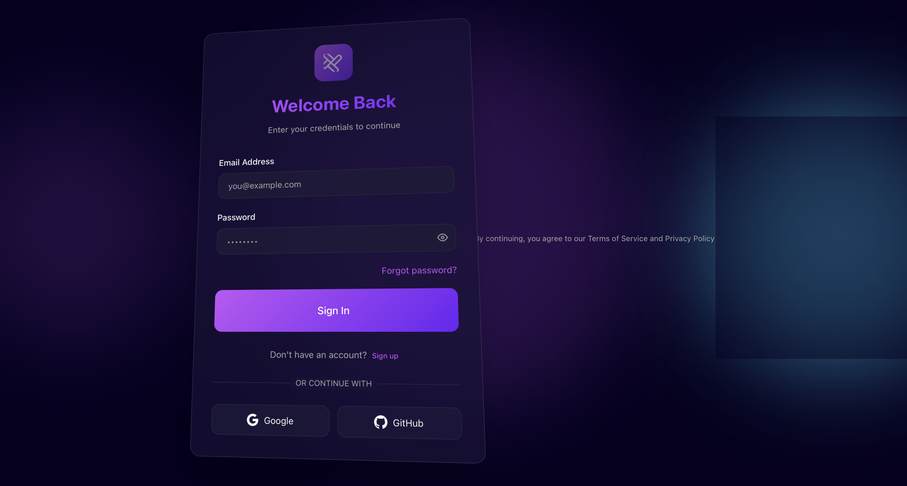

---

# 🌟 Ayush Modern Login Template

A sleek, modern, and fully responsive **Login & Signup page** designed with **glassmorphism aesthetics** and smooth animations. Perfect for integrating into any web project that needs a stylish authentication interface.

---

## 🚀 Features

* ✅ **Fully Responsive:** Works seamlessly across all devices.
* 💎 **Modern Glassmorphism UI:** Elegant blur and transparency effects.
* ⚡ **Smooth Animations:** Beautiful transitions and hover effects.
* 🔧 **Easy Integration:** Plug-and-play structure for quick setup.

---

## 🛠️ How to Use

1. **Copy** this folder into your project directory.
2. **Link** the included CSS and JS files in your HTML.
3. **Customize** text, colors, or branding as per your project requirements.

---

## 🖼️ Preview

---

## 💡 Notes

* Compatible with all modern browsers.
* Easy to integrate with backend authentication systems (Node.js, Django, etc.).
* Built with clean, well-commented HTML, CSS, and JS for easy understanding.

---

## 🧑‍💻 Author

**Ayush Srivastava (miracneroid)**

> Passionate about creating beautiful, responsive, and functional web interfaces.

---
